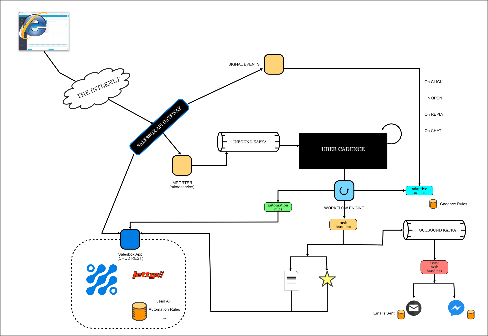

# Salesbox (v6) Architecture Reference Implementation

This is the Salesbox v6 Reference Architecture



## Structure

It is helpful to get an overview of the layout of this repository. The layout itself has been divided into two major portions:

* The Backend and
* The Frontend Webapp

The frontend webapp is a SPA sample app we can use to play with the architecture.

The backend is decoupled from the front end and contains all the microservices with REST api’s to serve any front end.

```
.
├── backend
│   ├── api-gateway
│   ├── authenticator
│   ├── biz-objects
│   └── setup-db
└── webapp
```

## Prerequisities

1. MySQL/MariaDB
2. Java 8+/Java 14
3. Golang
4. NodeJS
5. Kafka
6. Uber Cadence with Cassandra

## How to Use

1. Start all the backend services needed:

   *(The following are simply indicative - please follow the instructions on each website for actually installing them)*

   ```sh
   $> cd <kafka folder>
   $> ./bin/zookeeper-server-start.sh ./config/zookeeper.properties
   $> ./bin/kafka-server-start.sh ./config/server.properties
   
   $> cd <cadence folder>/docker
   $> docker-compose up
   
   $> cd <mysql folder>
   $> bin/mysqld_safe --user=<user>
   ```

2. Create the cadence domain:

   ```sh
   $> docker run --network=host --rm ubercadence/cli:master --do salesboxai-domain domain register -rd 1
   ```

3. Configure all the application links to the databases:

   ```sh
   $> cd setup-db && edit src/main/resources/application.properties
   $> cd importer && edit src/main/resources/application.yml
   $> cd authenticator && edit src/main/resources/application.yml
   $> cd lead-scoring && edit src/main/resources/application.yml
   $> cd biz-objects && edit src/main/resources/application.yml
   ```

4. Configure all application links to Kafka:

   ```sh
   $> cd importer && edit src/main/resources/application.yml
   $> cd activities && edit src/main/resources/application.yml
   $> cd conversations && edit src/main/resources/application.yml
   $> cd event-server && edit src/main/resources/application.yml
   $> cd workflow-engine && edit src/main/resources/application.yml
   ```

5. Configure workflow engine to link to Cadence:

   ```sh
   $> cd workflow-engine && edit src/main/resources/application.yml
   ```

6. Create all the required databases:

   ```sh
   $> cd backend/setup-db
   $> ./gradlew run --args=create-dbs
   (or to clear and restart)
   $> ./gradlew run --args=recreate-dbs
   ```

7. Start the Authenticator microservice:

   ```sh
   $> cd backend/authenticator
   $> ./gradlew run
   ```

8. Populate the tenant DB with sample data:

   ```sh
   $> cd backend/setup-db
   $> ./gradlew run --args=create-tenants
   ```

9. Start the ‘business object’ REST microservice:

   ```sh
   $> cd backend/biz-objects
   $> ./gradlew run
   ```

10. Populate the biz objects with sample workflow metadata:

    ```sh
    $> cd backend/setup-db
    $> ./gradlew run --args=create-workflow-meta
    ```

11. Start the other backend Microservices:

    ```sh
    $> cd importer && ./gradlew run
    $> cd activities && ./gradlew run
    $> cd conversation && ./gradlew run
    $> cd lead-scoring && ./gradlew run
    $> cd event-server && ./gradlew run
    $> cd workflow-engine && ./gradlew run
    ```

12. Start the front end webapp:

    ```sh
    $> cd webapp
    $> npm start
    ```

13. Start the API Gateway:

    ```sh
    $> cd backend/api-gateway
    $> go run gateway.go
    ```

14. Navigate to http://localhost/ and Sign Up to Get Started!

## Using the Application

1. Go to the workflow area and create the workflows you want for your tenant.

2. You can create additional workflow steps to demo that it is dynamic by using:

   ```sh
   $> cd backend/setup-db
   $> ./gradlew run --args=add-workflow-meta
   ```

3. Generate a test import file:

   ```sh
   $> cd leadgen
   $> ./gradlew run --args=<num of leads>
   ```

4. Go to Import area and drag the import file to start the import. This will trigger the workflow for new leads.

5. Go to Lead view and click the buttons that represent the lead performing certain actions. This will trigger the workflow for the appropriate events.

--------

